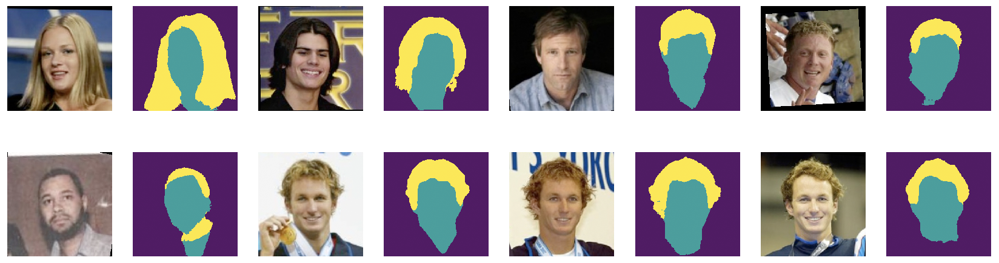

# Face Segmentation
Semantic segmentation for hair, face and background

Barebones version of [this repository](https://github.com/akirasosa/mobile-semantic-segmentation/).

## Dataset
Labeled faces in the wild. Get it from [here](https://www.dropbox.com/s/kkj73eklp5fnut0/data.zip?dl=0).


## Training
```
python train.py \
    --data-folder data/lfw \
    --pre-trained weights/mobilenet_v2.pth.tar \
    --output-folder scratch/ \
    --num-epochs=50 \
    --batch-size=32
```

## Testing

```
python test.py --data-folder data/samples/ --pre-trained checkpoints/model.pt
```


## Results
